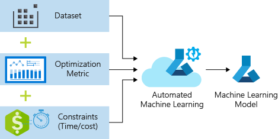

# Introducing Training ML models with AzureML 

## Objectives

In the following Excercise you will learn:
- Train a model using the Azure ML Designer
- Traing a model using Azure ML AutoML
- Train a model using the Azure ML Python SDK

## The AzureML Designer

### Prerequisites

To run through below instructions, you need an Azure subscription, an AzureML workspace and an AzureML compute target (i.e. **cpu-cluster**). See instructions on how to create a workspace [here](../../../0_setup/setup.md) and create an AzureML compute target [here](../../../1_concepts/concepts.md).

### Create an AzureML experiment using Designer

- In the AzureML studio, navigate to the Designer tab and click on it
  
  

- Create a new experiment buy opening Sample 3: Binary Classification with Feature Selection - Income Prediction from the list of available examples
  
  

- The graph for the sample experiment will open. You can inspect the properties of each of the steps, but you cannot see any outputs until you run the experiment. 
  
    

- In the setting tab, click on 'select compute target' and select the compute cluster we have created in the previous steps, **cpu-cluster**

  

- Click 'submit' button at the top-right. Create a new experiment (e.g. **designer-exp**) and press 'Submit'
    

- Wait until all steps are done ( a green tick-mark appears on the corner of each step)

    

- Once you ran the experiment, you can inspect the outputs of the individual steps -- check out the output of the different steps, in particular the "Evaluate Model" step. Click on the step, which will take you to the outputs:
    

- Click on the "visualize" button in the "Evaluation results' tab which will show a graphical representation for the binary classification evaluation and the predicted values for the test data:
    

## Automated Machine Learning

### Prerequisites

To run through below instructions, you need an Azure subscription, an AzureML workspace, a registered data set (i.e. **german-credit**) and an AzureML compute target (i.e. **cpu-cluster**). See instructions on how to create a workspace [here](../../../0_setup/setup.md), register an AzureML dataset and create an AzureML compute target [here](../../../1_concepts/concepts.md).

### Create your first automated ML experiment

Automated machine learning (automated ML) builds high quality machine learning models for you by automating model and hyperparameter selection. Bring a labelled dataset that you want to build a model for, automated ML will give you a high quality machine learning model that you can use for predictions.

If you are new to Data Science, automated ML will help you get jumpstarted by simplifying machine learning model building. It abstracts you from needing to perform model selection, hyperparameter selection and in one step creates a high quality trained model for you to use.

If you are an experienced data scientist, automated ML will help increase your productivity by intelligently performing the model and hyperparameter selection for your training and generates high quality models much quicker than manually specifying several combinations of the parameters and running training jobs. Automated ML provides visibility and access to all the training jobs and the performance characteristics of the models to help you further tune the pipeline if you desire.

### Using Automated Machine Learning

Follow the instructions in the [documentation](https://docs.microsoft.com/en-us/azure/machine-learning/service/how-to-create-portal-experiments) for a full overview of the user interface.

1. Navigate to the left pane of your workspace. Select Automated ML under the Author section.

   .

2. Enter your experiment name, then select a compute from the list of your existing computes or       [create a new compute](https://docs.microsoft.com/en-us/azure/machine-learning/service/how-to-create-portal-experiments#create-an-experiment).

3. Select a the German credit dataset (**german-credit**) that you have created [before](../../../1-Concepts/2-Datastores-datasets/UI/README.md).

4. Preview data and keep all columns selected for training.

5. Select the training job type: **Classification**

6. Select target column: **Risk**

7. Open “**Advanced settings**”, set the 'Primary metric' to 'AUC_weighted' and training job time to 15 minutes (for the workshop).

8. Hit "**Start**" and wait for the training job to start. You’ll be able to see the models which are created during the run, click on any of the models to open the detailed view of that model, where you can analyze the [graphs and metrics](https://docs.microsoft.com/en-us/azure/machine-learning/service/how-to-understand-automated-ml).

9. Once the run is completed, click **deploy the best model** to create a deployed endpoint from the model.

To learn more about automated ML, see documentation [here](https://docs.microsoft.com/en-us/azure/machine-learning/service/concept-automated-ml).

### Optional Tasks:
- Once your model has been deployed, follow these [instructions](https://docs.microsoft.com/en-us/power-bi/service-machine-learning-integration) to consume the model from Power BI.

- Try the sample notebooks [here](https://github.com/Azure/MachineLearningNotebooks/tree/master/how-to-use-azureml/automated-machine-learning).

## The Automated Machine Learning (SDK)

### Prerequisites

To run through below instructions, you need an Azure subscription, an AzureML workspace, a registered data set (i.e. **german-credit**) and an AzureML compute target (i.e. **cpu-cluster**). See instructions on how to create a workspace [here](../../../0_setup/setup.md), register an AzureML dataset and create an AzureML compute target [here](../../../1_concepts/concepts.md).

### Train a model with Azure Automated ML

In this tutorial, you use automated machine learning in Azure Machine Learning to create a classification model to predict credit risk for German credit dataset. This process accepts training data and configuration settings, and automatically iterates through combinations of different feature normalization/standardization methods, models, and hyperparameter settings to arrive at the best model.

Here we are considering two main scenarios:

### Train an Auto ML model on local compute

1. Run the setup notebook to install automl and onnx-runtime [Python SDK](../SDK/local-compute/setup.ipynb) 
2. Train a model using Automated ML on local compute:  [Python SDK](../SDK/local-compute/binayclassification-german-credit-autoaml-local-compute.ipynb)

### Train an Auto ML model on a remote compute

 - Run the notebook for AutoML remote compute:  [Python SDK](../SDK/remote-compute/binayclassification-german-credit-autoaml-remote-amlcompute.ipynb)

See also [here](https://docs.microsoft.com/en-us/azure/machine-learning/tutorial-auto-train-models?view=azure-ml-py), for another example of trainig a model using Azure Automated ML.
